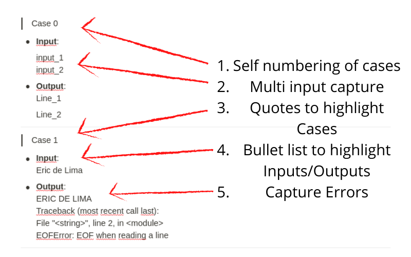

#  Automator Case Test

##  A simple script to create an organized base of Test Cases, used when creating questions in collaborative [Notion](https://www.notion.so/) of Monitors.


#
## Using:
1. Clone this repository
2. Replace the codes in bargage folder
    1. Your script must be in the script.py file
    2. Test cases must have a line break between cases, in the output.txt file
3. Run in your shell:
    ```sh
    python3 src/app.py
    ```
4. Copy the output code in bargage/output.txt
5. Paste on the respective page in Notion

#
## Objectives
- Create a formatting pattern to facilitate the analysis of the question, transforming a simple text into this:

- This application also creates a raw data in path bargage/raw_output.txt, a file to facilitate raw data entry into the online judge.

#
## Author
| <a href="https://github.com/ericxlima"></a> |
| :----: |
| [Eric de Lima](https://github.com/ericxlima) |
